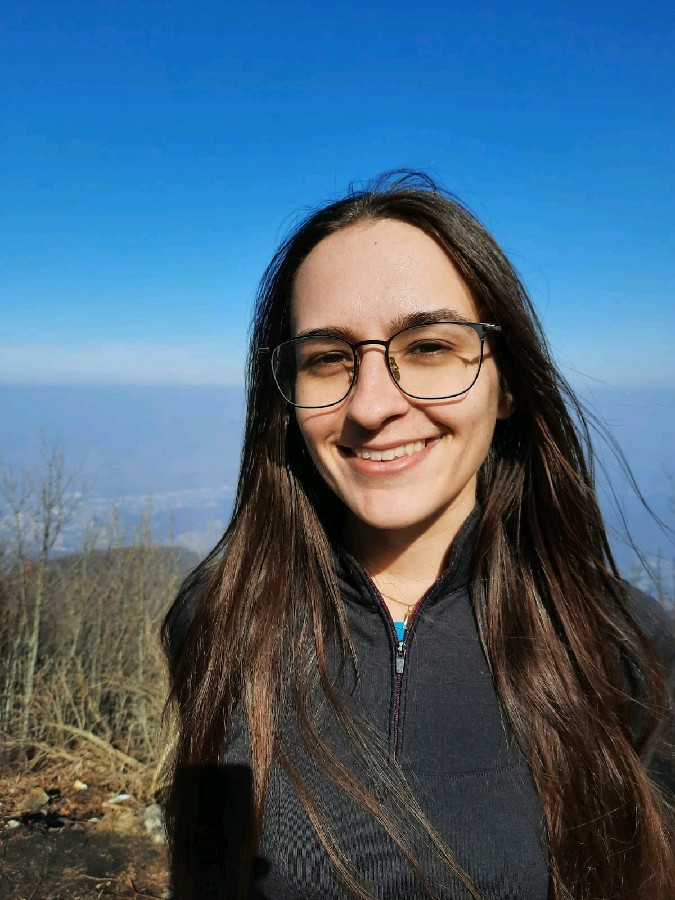

# Lorena Zuzic

Assistant Professor, Department of Molecular Biology and Genetics, Aarhus University

lorena.zuzic@mbg.au.dk · [ORCID](https://orcid.org/0000-0002-7834-612X)

## About

I am an assistant professor at the Department of Molecular Biology and Genetics,
Aarhus University. 
My research uses molecular dynamics simulations to understand the dynamics of membrane proteins
in their natural environments.

My focus is on **plant membrane environments** and the effect of complex plant membranes
affects the conformational landscape of membrane proteins.

I am also interested in **plant transporter proteins**, including sucrose and auxin transporters.
In that context, I am investigating the molecular basis of a **proton-driven transport** (how proton coupling 
determines substrate binding and transport mechanism).

During my PhD I investigated viral envelopes, in particular **pH-dependent conformational
changes** in flaviviruses and the SARS-CoV-2 spike protein.

## Methods

- Unbiased atomistic and coarse-grained molecular dynamics simulations (GROMACS)
- Binding free energy calculations
- accelerated weight histogram (AWH) method
- Constant-pH simulations
- pKa predictions
- Solvent-probe (benzene) mapping for cryptic pocket discovery

## Experience

- **Assistant Professor**, Aarhus University, Denmark (Oct 2025 – present)
- **Postdoctoral Researcher**, Aarhus University, Denmark (Oct 2021 – Sep 2025)
- **PhD in Chemistry**, University of Manchester, UK / A*STAR, Singapore
  (Sep 2017 – Sep 2021). Thesis: "A simulation approach to cryptic pocket discovery
  in viral envelopes."

## Publications

1. Mishra, A., Golbek, T.W., Thomassen, A.B., **Zuzic, L.**, …, Otzen, D.E., Weidner, T. (2025)
   Pathological folding of α-synuclein on polystyrene nanoplastic revealed by sum frequency
   scattering and 2D infrared spectroscopy.
   *J. Phys. Chem. Lett.*, 16(45), 11893–11900. ¹ §
   [doi:10.1021/acs.jpclett.5c02526](https://doi.org/10.1021/acs.jpclett.5c02526)

2. Ung, K.L., Schulz, L., **Zuzic, L.**, Amsinck, B.L., Koutnik-Abele, S., …, Stokes, D.L.,
   Hammes, U.Z., Pedersen, B.P. (2025)
   Structures and mechanism of the AUX/LAX transporters involved in auxin import.
   *Nature Plants*, 11, 1670–1680. §
   [doi:10.1038/s41477-025-02056-z](https://doi.org/10.1038/s41477-025-02056-z)

3. Stange, A.D., **Zuzic, L.**, Schiøtt, B. and Berglund, N.A. (2025)
   Exploring insulin-receptor dynamics: stability and binding mechanisms.
   *Structure*, 33(8), 1425–1435.e2.
   [doi:10.1016/j.str.2025.04.022](https://doi.org/10.1016/j.str.2025.04.022)

4. Andreasen, M.D., Souza, P.C.T., Schiøtt, B. and **Zuzic, L.** (2025)
   Coarse-grained System Builder: Towards higher accuracy in membrane complexity.
   *J. Chem. Inf. Model.*, 65(10), 4760–4766. C
   [doi:10.1021/acs.jcim.5c00069](https://doi.org/10.1021/acs.jcim.5c00069)

5. Schulz, L., Ung, K.L., **Zuzic, L.**, Koutnik-Abele, S., Schiøtt, B., Stokes, D.L.,
   Pedersen, B.P. and Hammes, U.Z. (2025)
   Transport of phenoxyacetic acid herbicides by PIN-FORMED auxin transporters.
   *Nature Plants*, 11, 1049–1059. §
   [doi:10.1038/s41477-025-01984-0](https://doi.org/10.1038/s41477-025-01984-0)

6. **Zuzic, L.**, Samsudin, F., Marzinek, J.K. and Bond, P.J. (2024)
   Mechanisms of allostery at the viral surface through the eyes of molecular simulation.
   *Curr. Opin. Struct. Biol.*, 84, 102761. ¹
   [doi:10.1016/j.sbi.2023.102761](https://doi.org/10.1016/j.sbi.2023.102761)

7. **Zuzic, L.**, Suteau, V., Hansen, D.H., Kjølbye, L.R., Sibilia, P., … and Munier, M. (2024)
   Effects and risk assessment of halogenated bisphenol A derivatives on human follicle
   stimulating hormone receptor: an interdisciplinary study.
   *J. Hazard. Mater.*, 479, 135619. ¹
   [doi:10.1016/j.jhazmat.2024.135619](https://doi.org/10.1016/j.jhazmat.2024.135619)

8. Bavnhøj, L., Driller, J.H., **Zuzic, L.**, Stange, A.D., Schiøtt, B. and Pedersen, B.P. (2023)
   Structure and sucrose binding mechanism of the plant SUC1 sucrose transporter.
   *Nature Plants*, 9, 938–950. §
   [doi:10.1038/s41477-023-01421-0](https://doi.org/10.1038/s41477-023-01421-0)

9. **Zuzic, L.**, Marzinek, J.K., Anand, G.S., Warwicker, J. and Bond, P.J. (2023)
   A pH-dependent cluster of charges in a conserved cryptic pocket on flaviviral envelopes.
   *eLife*, 12, e82447. ¹
   [doi:10.7554/eLife.82447](https://doi.org/10.7554/eLife.82447)

10. Tupiņa, D., Krah, A., Marzinek, J.K., **Zuzic, L.**, Moverley, A.A., Constantinidou, C.
    and Bond, P.J. (2022)
    Bridging the N-terminal and middle domains in FliG of the flagellar rotor.
    *Curr. Res. Struct. Biol.*, 4, 59–67.
    [doi:10.1016/j.crstbi.2022.02.002](https://doi.org/10.1016/j.crstbi.2022.02.002)

11. **Zuzic, L.**, Samsudin, F., Shivgan, A.T., Raghuvamsi, P.V., Marzinek, J.K., Boags, A., …
    and Bond, P.J. (2022)
    Uncovering cryptic pockets in the SARS-CoV2 spike glycoprotein.
    *Structure*, 30(8), 1062–1074.e4. ¹
    [doi:10.1016/j.str.2022.05.006](https://doi.org/10.1016/j.str.2022.05.006)

12. Allen, J.D., Chawla, H., Samsudin, F., **Zuzic, L.**, Shivgan, A.T., Watanabe, Y., …
    and Crispin, M. (2021)
    Site-specific steric control of SARS-CoV2 spike glycosylation.
    *Biochemistry*, 60(27), 2153–2169.
    [doi:10.1021/acs.biochem.1c00279](https://doi.org/10.1021/acs.biochem.1c00279)

13. **Zuzic, L.**, Marzinek, J.K., Warwicker, J. and Bond, P.J. (2020)
    A benzene mapping approach for uncovering cryptic pockets in membrane-bound proteins.
    *J. Chem. Theory Comput.*, 16(9), 5948–5959. ¹
    [doi:10.1021/acs.jctc.0c00370](https://doi.org/10.1021/acs.jctc.0c00370)
    
## Miscellaneous

- **Second place, 3-Minute Thesis competition** (University of Manchester level, 2021):
  three minutes on cryptic pockets in viral envelopes for a non-specialist audience.
- **Festival of Research, Aarhus University (2025 and 2026)**: outreach stand titled
  "The edge of life: how molecules and information get across the cell membranes."

